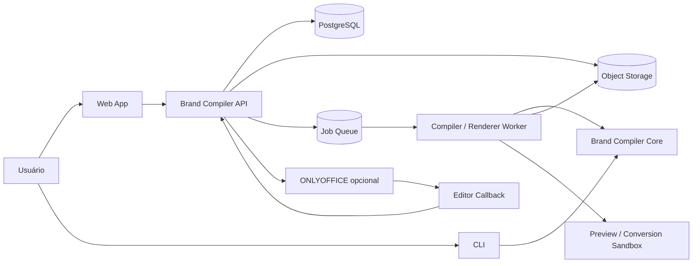
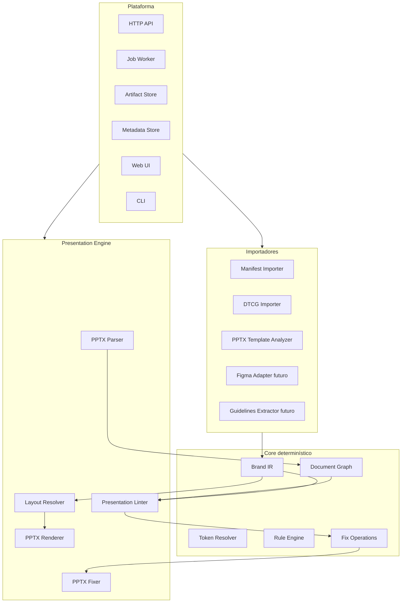
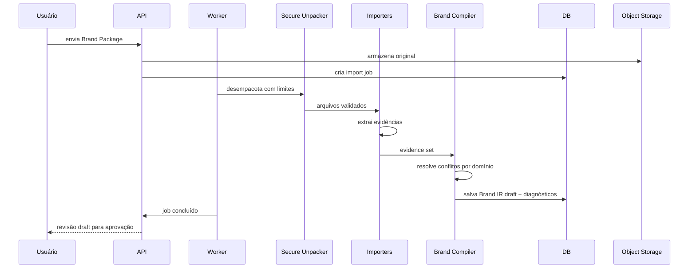
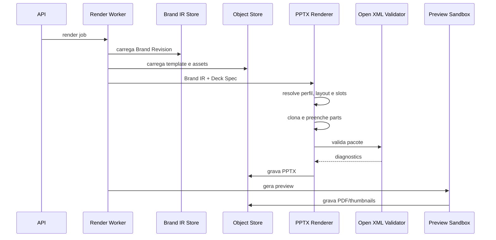

# System Design — Brand Compiler

**Status:** proposta técnica v0.1  
**Data:** 12 de julho de 2026  
**Escopo deste documento:** arquitetura do primeiro produto utilizável, concentrado em apresentações `.pptx` nativas e editáveis, importação de uma marca existente e validação pós-edição.

---

## 1. Resumo da decisão

O sistema será um **compilador de marca e runtime de conformidade documental**.

Ele não cria a identidade visual. Ele recebe fontes de marca existentes, transforma essas fontes em uma representação intermediária versionada e executável — o **Brand IR** — e usa essa representação para:

1. gerar apresentações `.pptx` nativas e editáveis;
2. analisar versões editadas dessas apresentações;
3. detectar desvios de marca;
4. aplicar correções determinísticas e seguras;
5. produzir PDF e imagens como derivados de distribuição.

A primeira versão não será um clone de PowerPoint, Word ou Canva. Ela será uma camada que se conecta a esses formatos e, mais tarde, a editores existentes.

A composição central é:

```text
Brand Package + Deck Spec
          ↓
      Brand Compiler
          ↓
      Brand IR versionado
          ↓
    PPTX Native Renderer
          ↓
      PPTX editável
          ↓
   edição pelo usuário
          ↓
PPTX Parser → Brand Linter → Fix Plan
          ↓
   nova revisão do PPTX
```

---

## 2. Tese de produto

### 2.1 Problema resolvido

Templates ajudam a começar, mas não garantem que um arquivo continue correto depois que:

- o usuário troca fontes;
- cola conteúdo de outra apresentação;
- altera cores;
- redimensiona o logo;
- move objetos;
- cria novos slides;
- edita o arquivo fora da plataforma.

A tese do produto é que uma marca precisa deixar de ser apenas documentação e passar a existir como **regra executável**.

### 2.2 O que o produto promete

> Dada uma marca já definida e um conteúdo estruturado, gerar um arquivo Office nativo, editável e rastreável; depois, verificar se alterações posteriores continuam em conformidade com a marca.

### 2.3 O que o produto não promete

O MVP não deve prometer:

- criar uma identidade visual;
- inferir com precisão uma marca completa a partir de qualquer PDF;
- transformar tokens de cor e fonte, sozinhos, em layouts sofisticados;
- editar semanticamente PDFs;
- substituir PowerPoint ou Word;
- gerar qualquer composição visual possível;
- usar IA como autoridade final de conformidade;
- suportar simultaneamente PPTX, DOCX e edição web completa.

---

## 3. Premissas que precisam ser explícitas

### 3.1 Não existe um único arquivo universal de marca

A marca pode estar distribuída entre:

- tokens DTCG ou JSON proprietário;
- template `.pptx`;
- template `.docx`;
- Figma;
- ativos em SVG, PNG ou outros formatos;
- fontes;
- guidelines em PDF;
- regras escritas;
- exemplos aprovados.

Por isso, a unidade de entrada é um **Brand Package**, não um “arquivo de design system”.

### 3.2 Tokens não descrevem toda a composição

Tokens descrevem valores reutilizáveis, aliases, tipos e decisões visuais. Eles não determinam necessariamente:

- qual layout deve ser usado;
- onde o logo deve aparecer;
- quanto texto cabe;
- quais composições são aprovadas;
- como adaptar uma capa para 16:9 ou 9:16;
- qual regra tem prioridade em caso de conflito.

Logo, o MVP deve ser **template-first**:

- tokens são a fonte preferencial para valores;
- o template PPTX é a fonte preferencial para masters, layouts e placeholders;
- regras explícitas completam o que não está nos tokens nem no template.

### 3.3 Um formato de página por arquivo

O tamanho do slide é uma propriedade da apresentação. Portanto, um deck 16:9, um post quadrado e um story vertical devem ser tratados como **perfis e arquivos de saída distintos**, mesmo quando usam o mesmo Brand IR e o mesmo conteúdo.

### 3.4 Arquivo nativo é requisito, não detalhe

Um PPTX é considerado válido para este produto apenas quando:

- texto permanece texto;
- imagens continuam substituíveis;
- tabelas são tabelas;
- objetos mantêm estrutura editável;
- masters e layouts são preservados;
- temas e referências semânticas são usados quando possível;
- o arquivo abre sem reparo;
- a edição e o salvamento não destroem a estrutura principal.

---

## 4. Escopo do MVP

### 4.1 Entradas obrigatórias

O primeiro MVP aceitará:

1. um `brand.json` válido;
2. tokens em formato DTCG ou um subconjunto compatível;
3. um template `.pptx` real;
4. ativos de marca;
5. regras explícitas opcionais;
6. um `deck-spec.json` com conteúdo estruturado.

### 4.2 Saídas

O MVP produzirá:

- `.pptx` nativo e editável;
- relatório JSON de importação;
- relatório JSON de lint;
- `.pptx` corrigido como nova revisão;
- PDF e thumbnails como derivados opcionais.

### 4.3 Elementos suportados no P0

- texto;
- imagens;
- logos;
- formas simples;
- linhas;
- tabelas básicas;
- notas do apresentador;
- layouts baseados em slide master.

### 4.4 Elementos adiados

- gráficos nativos complexos;
- SmartArt;
- animações e transições;
- vídeo e áudio;
- objetos OLE;
- macros;
- colaboração em tempo real;
- DOCX;
- inferência autoritativa a partir de PDF;
- geração livre de layout por IA.

---

## 5. Requisitos funcionais

### FR-01 — Importar Brand Package

O sistema deve receber um pacote ZIP ou diretório, validar sua estrutura e registrar todos os artefatos por hash.

### FR-02 — Resolver tokens

O sistema deve:

- validar tipos;
- resolver aliases;
- detectar referências circulares;
- preservar a origem de cada valor;
- emitir erro quando o tipo não puder ser determinado;
- produzir valores normalizados.

### FR-03 — Analisar template PPTX

O sistema deve extrair:

- tamanho da apresentação;
- temas;
- esquemas de cor e fonte;
- slide masters;
- slide layouts;
- placeholders;
- estilos padrão;
- ativos incorporados;
- nomes e IDs nativos relevantes.

### FR-04 — Compilar Brand IR

O sistema deve combinar evidências do manifesto, tokens, template e regras explícitas e criar uma revisão imutável do Brand IR.

### FR-05 — Resolver conflitos

O importador deve mostrar:

- valor escolhido;
- fontes conflitantes;
- regra de precedência aplicada;
- confiança;
- itens não resolvidos.

Nenhum conflito material deve ser resolvido silenciosamente.

### FR-06 — Renderizar PPTX

O renderer deve combinar Brand IR e Deck Spec, criar slides usando layouts nativos e preencher slots sem converter a página inteira em imagem.

### FR-07 — Validar o PPTX gerado

Antes de publicar o arquivo, o sistema deve:

- validar a estrutura Open XML;
- verificar relações quebradas;
- verificar IDs duplicados;
- rejeitar macros e conteúdo ativo não permitido;
- produzir um preview;
- registrar diagnósticos.

### FR-08 — Receber uma versão editada

O usuário deve poder enviar novamente um PPTX editado. O sistema deve preservar o original e criar uma nova revisão.

### FR-09 — Construir Document Graph

O parser deve transformar a estrutura real da apresentação em um grafo normalizado com slides, objetos, estilos, texto, bounds, relações com layouts e tags semânticas.

### FR-10 — Executar lint

O linter deve comparar Document Graph com Brand IR e produzir findings localizáveis, auditáveis e reproduzíveis.

### FR-11 — Aplicar correções

O fixer deve aplicar apenas operações explícitas a uma cópia do arquivo e gerar nova revisão. O sistema nunca deve sobrescrever o original.

### FR-12 — Exportar derivados

O sistema deve conseguir gerar PDF e imagens de preview em processo isolado.

---

## 6. Requisitos não funcionais

### NFR-01 — Determinismo

A mesma versão do Brand IR, o mesmo Deck Spec e a mesma versão do renderer devem produzir estrutura equivalente. Timestamps e IDs não determinísticos devem ser normalizados nos testes.

### NFR-02 — Auditabilidade

Cada token, role, layout, regra e correção deve ter provenance suficiente para responder:

- de onde veio;
- qual versão o produziu;
- qual regra tomou a decisão;
- qual arquivo foi alterado.

### NFR-03 — Imutabilidade de artefatos

Brand revisions, document revisions e lint runs são imutáveis. Mudanças criam novas revisões.

### NFR-04 — Segurança de arquivos não confiáveis

Uploads devem ser tratados como conteúdo hostil.

### NFR-05 — Extensibilidade

Importadores, renderers, regras e fixers devem usar interfaces estáveis e poder ser adicionados sem acoplamento à UI.

### NFR-06 — Self-hosting

O sistema deve funcionar localmente via Docker Compose e não depender obrigatoriamente de SaaS externo.

### NFR-07 — Observabilidade

Todo job deve ter ID de correlação, logs estruturados, métricas e status consultável.

### NFR-08 — Compatibilidade

O alvo primário do MVP é PowerPoint moderno. ONLYOFFICE e LibreOffice entram como ambientes de compatibilidade, não como referência única de fidelidade.

---

## 7. Arquitetura recomendada

### 7.1 Estilo arquitetural

Usar um **modular monolith com worker separado**, não microserviços.

Razões:

- o domínio ainda está sendo descoberto;
- as fronteiras mudam durante o MVP;
- transações e versionamento são mais simples;
- a principal complexidade está em OOXML, não em distribuição;
- o core pode continuar modular e ser extraído depois, se houver necessidade real.

### 7.2 Diagrama de contexto



### 7.3 Diagrama de módulos



### 7.4 Componentes

#### `BrandCompiler.Core`

Não depende de HTTP, banco, fila, editor ou sistema operacional. Contém:

- IDs e tipos de domínio;
- Brand IR;
- resolver de tokens;
- provenance;
- diagnósticos;
- contratos de regra;
- findings;
- fix operations;
- política de versionamento.

#### `BrandCompiler.Importers.Dtcg`

Responsável por:

- ler `.tokens` e `.tokens.json`;
- validar o formato suportado;
- resolver aliases;
- normalizar cores e dimensões;
- preservar extensões desconhecidas;
- produzir evidências.

#### `BrandCompiler.Importers.Pptx`

Responsável por analisar um template e produzir:

- template descriptor;
- theme descriptor;
- master descriptor;
- layout descriptor;
- placeholder descriptor;
- asset references;
- diagnósticos de compatibilidade.

#### `BrandCompiler.BrandCompiler`

Combina evidências segundo políticas por domínio:

- cor;
- tipografia;
- ativos;
- layouts;
- regras.

Produz Brand IR draft e exige aprovação quando há conflitos materiais.

#### `BrandCompiler.Presentation.Renderer`

Clona o template, cria slides a partir dos layouts nativos e preenche slots.

#### `BrandCompiler.Presentation.Parser`

Lê um PPTX real e cria o Document Graph.

#### `BrandCompiler.Presentation.Linting`

Executa regras sobre o Document Graph e o Brand IR.

#### `BrandCompiler.Presentation.Fixer`

Aplica operações seguras sobre uma cópia do PPTX.

#### `BrandCompiler.Api`

Expõe operações assíncronas, autenticação, autorização, idempotência e URLs assinadas.

#### `BrandCompiler.Worker`

Executa importação, compilação, renderização, lint, fix e conversão em ambiente separado.

#### `BrandCompiler.Cli`

É a primeira interface funcional. Deve existir antes da UI web.

---

## 8. Stack fixada

### 8.1 Backend e core

- **C# com .NET LTS**
- **Open XML SDK** para ler e alterar OOXML
- `System.Text.Json`
- validador JSON Schema 2020-12
- PostgreSQL
- armazenamento S3-compatible, com MinIO no desenvolvimento local
- job queue persistida; no MVP pode usar PostgreSQL/Hangfire ou uma tabela de jobs com locking transacional
- OpenTelemetry para logs, traces e métricas

### 8.2 Frontend

- Next.js
- TypeScript
- React
- componentes acessíveis e sem dependência direta do motor OOXML

### 8.3 Preview e conversão

- serviço isolado com LibreOffice headless para o primeiro preview;
- adapter de ONLYOFFICE como alternativa e para edição embutida;
- preview não é a fonte de verdade estrutural.

### 8.4 Testes

- xUnit no core .NET;
- Playwright na UI;
- testes de contrato JSON Schema;
- golden files Open XML;
- regressão visual por imagem;
- validação em uma matriz de editores.

### 8.5 Decisão sobre IA

IA não participa da decisão final de conformidade.

Uso futuro permitido:

- sugerir mapeamento de tokens para roles;
- resumir guideline textual;
- classificar layouts;
- sugerir conteúdo;
- explicar findings.

Toda sugestão precisa ser materializada como configuração explícita e aprovada antes de virar regra.

---

## 9. Modelo de domínio

### 9.1 Entidades principais

#### Workspace

Agrupa usuários, marcas e documentos. Pode ser omitido no modo local de usuário único, mas o modelo deve suportá-lo.

#### Brand

Identidade lógica de uma marca.

#### Brand Revision

Versão imutável e publicada do Brand IR.

#### Source Artifact

Arquivo fornecido como evidência: tokens, template, guideline, asset ou override.

#### Asset

Logo, ícone, imagem, fonte ou template, identificado por hash.

#### Document

Identidade lógica de uma apresentação.

#### Document Revision

Versão imutável do arquivo PPTX.

#### Render Job

Execução que combina Brand Revision e Deck Spec.

#### Lint Run

Execução que compara Document Revision e Brand Revision.

#### Finding

Violação individual, com local, regra, severidade, esperado, observado e operações de correção.

#### Waiver

Exceção aprovada, com justificativa, autor e validade. É P1, não P0.

### 9.2 Modelo de persistência

```text
workspaces
users
workspace_members

brands
brand_revisions
source_artifacts
assets

documents
document_revisions
deck_specs

jobs
render_runs
lint_runs
findings
fix_runs
audit_events
```

Binaries ficam em object storage. PostgreSQL guarda:

- metadados;
- hashes;
- status;
- JSONB do Brand IR;
- JSONB do Deck Spec;
- findings;
- relações e auditoria.

### 9.3 Endereçamento por conteúdo

Cada artefato deve ter SHA-256. Um mesmo binário não precisa ser armazenado duas vezes.

Exemplo de object key:

```text
sha256/ab/cd/abcdef.../artifact.pptx
```

---

## 10. Brand Package

### 10.1 Estrutura

```text
brand-package/
├── brand.json
├── tokens.tokens.json
├── rules.json
├── assets/
│   ├── logos/
│   ├── icons/
│   └── images/
├── fonts/
├── templates/
│   └── presentation.pptx
└── references/
    └── guidelines.pdf
```

### 10.2 Política de autoridade por domínio

Não use uma prioridade global. Use prioridade específica:

| Domínio | Ordem padrão |
|---|---|
| Cores | override explícito → tokens → tema PPTX → inferência |
| Tipografia | override explícito → tokens → tema/master PPTX → inferência |
| Logos e ativos | manifesto → diretório de ativos → template → inferência |
| Layouts | template PPTX → configuração explícita → inferência |
| Regras | rules.json → configuração do layout → guideline extraída |
| Conteúdo | Deck Spec → entrada do usuário |

### 10.3 Pipeline de importação



### 10.4 Evidência e provenance

Cada valor compilado deve apontar para uma ou mais evidências:

```json
{
  "sourceId": "tokens-main",
  "sourceType": "dtcg-tokens",
  "path": "tokens.tokens.json",
  "pointer": "#/color/brand/primary",
  "confidence": 1.0,
  "authoritative": true
}
```

Confiança não substitui autoridade. Um valor inferido com confiança 0,99 não deve derrotar um valor estruturado marcado como autoritativo.

---

## 11. Brand IR

### 11.1 Função

O Brand IR desacopla a marca de:

- Figma;
- PowerPoint;
- Word;
- DTCG;
- editor web;
- banco;
- API.

Ele é o contrato central do produto.

### 11.2 O DTCG não deve virar o Brand IR inteiro

O formato DTCG deve ser usado para tokens e aliases. Regras críticas de documentos, layouts, provenance e mapeamentos nativos ficam no Brand IR.

Não concentre regras indispensáveis em `$extensions` de tokens. Extensões são úteis para metadados e interoperabilidade, mas o runtime precisa de contratos próprios e versionados.

### 11.3 Estrutura lógica

```json
{
  "schemaVersion": "0.1.0",
  "brand": {},
  "revision": {},
  "tokens": {},
  "semanticRoles": {},
  "assets": {},
  "presentationProfiles": [],
  "rules": [],
  "provenance": [],
  "diagnostics": []
}
```

### 11.4 Três modelos diferentes

Não tente usar um único JSON para tudo.

#### Brand IR

Representa a marca executável.

#### Deck Spec

Representa o conteúdo desejado.

#### Document Graph

Representa o que realmente existe no PPTX.

Operações:

```text
Brand IR + Deck Spec → Renderer → PPTX
PPTX → Parser → Document Graph
Brand IR + Document Graph → Linter → Findings
PPTX + Fix Operations → Fixer → novo PPTX
```

### 11.5 Versionamento

- `schemaVersion` segue SemVer;
- Brand Revision é imutável;
- mudanças incompatíveis no schema aumentam major;
- migrations devem ser explícitas;
- renderer e linter registram suas próprias versões;
- um documento guarda o `brandRevisionId` que o originou.

---

## 12. Deck Spec e modelo de conteúdo

### 12.1 Por que conteúdo estruturado

O renderer não deve receber HTML arbitrário ou instruções visuais vagas no P0. Deve receber conteúdo semântico em slots conhecidos.

Exemplo:

```json
{
  "brandRevisionId": "brandrev_acme_0001",
  "profileId": "presentation-16x9",
  "slides": [
    {
      "id": "cover",
      "layoutId": "cover",
      "fields": {
        "title": "Resultado trimestral",
        "subtitle": "Julho de 2026"
      }
    }
  ]
}
```

### 12.2 Layouts e slots

Um layout define:

- ID estável;
- referência ao slide layout nativo;
- propósito;
- slots;
- roles semânticos;
- política de fitting;
- limites.

Exemplo:

```text
layout: title-and-body
  slot title
    kind: text
    role: text.title
    required: true
  slot body
    kind: text
    role: text.body
    fit: create-continuation-slide
```

### 12.3 Política de overflow

Ordem recomendada:

1. usar tamanho ideal;
2. reduzir até o mínimo permitido;
3. ajustar espaçamento dentro do intervalo permitido;
4. criar slide de continuação quando o layout permitir;
5. falhar com diagnóstico.

O sistema não deve truncar conteúdo silenciosamente.

---

## 13. Renderer PPTX

### 13.1 Estratégia template-first

O renderer não constrói um PPTX completo do zero no primeiro MVP. Ele:

1. copia o template;
2. preserva masters, layouts, themes e relações;
3. remove slides de demonstração quando configurado;
4. cria novos slide parts baseados em layouts existentes;
5. preenche placeholders;
6. adiciona objetos quando o slot não tem placeholder;
7. registra tags do Brand Compiler;
8. valida o pacote;
9. salva um novo artefato.

Essa estratégia reduz o risco de produzir um PPTX tecnicamente válido, mas semanticamente pobre.

### 13.2 Pipeline



### 13.3 Tags semânticas

O sistema precisa reencontrar objetos depois da edição.

Use redundância:

- nome do shape com prefixo, por exemplo `bc:title:slide-cover`;
- descrição/alt text com role;
- custom properties do documento;
- custom XML part com mapa de IDs;
- referência ao Brand Revision.

Nenhum mecanismo isolado deve ser considerado suficiente, porque editores podem alterar ou remover metadados.

### 13.4 Unidades

OOXML usa EMUs para geometria. O core deve trabalhar com um tipo `Dimension` e converter apenas na borda do renderer.

Evite `double` solto em todo o código. Use value objects:

```csharp
public readonly record struct Length(decimal Value, LengthUnit Unit);
```

### 13.5 Texto e métricas

O fitting deve usar métricas reais das fontes disponíveis no worker. Mesmo assim, a quebra de linha pode variar entre editores.

A política deve combinar:

- medição local;
- limites conservadores;
- preview renderizado;
- finding de overflow;
- nunca apagar texto automaticamente.

### 13.6 Imagens e logos

- validar MIME por conteúdo, não apenas extensão;
- sanitizar SVG;
- guardar original e fallback raster;
- preservar aspect ratio;
- armazenar hash do ativo aprovado;
- registrar crop e bounds;
- bloquear links externos no P0.

### 13.7 Tabelas

P0 suporta tabelas simples:

- linhas e colunas;
- cabeçalho opcional;
- estilos aprovados;
- sem células mescladas complexas;
- sem fórmulas;
- sem planilha incorporada.

### 13.8 Gráficos

Gráficos nativos ficam para P1. Eles envolvem chart parts, relações adicionais e, com frequência, workbook incorporado. Não use imagem de gráfico e chame isso de “gráfico editável”.

---

## 14. Parser e Document Graph

### 14.1 Objetivo

O parser transforma o PPTX real em um modelo uniforme para o linter.

### 14.2 Estrutura

```text
PresentationGraph
  pageSize
  theme
  masters
  layouts
  slides[]
    id
    index
    layoutRef
    shapes[]
      id
      name
      kind
      bounds
      rotation
      semanticTags
      effectiveStyle
      text
      assetHash
```

### 14.3 Estilo efetivo

O parser precisa distinguir:

- formatação direta;
- estilo do run;
- estilo do parágrafo;
- placeholder;
- slide layout;
- slide master;
- theme;
- defaults.

O P0 deve garantir resolução completa para arquivos gerados pelo próprio sistema. Em arquivos arbitrários, o parser pode emitir `confidence < 1` e limitar auto-fixes.

### 14.4 Objetos sem tags

Quando um usuário cria um objeto novo:

1. tentar inferir o tipo pelo placeholder;
2. tentar associar pela geometria do layout;
3. tentar associar por nome;
4. marcar como não classificado;
5. não aplicar correção destrutiva com baixa confiança.

---

## 15. Linter

### 15.1 Interface

```csharp
public interface IBrandRule
{
    string Id { get; }
    IEnumerable<Finding> Evaluate(
        BrandIr brand,
        PresentationGraph document,
        RuleExecutionContext context);
}
```

### 15.2 Findings

Cada finding precisa conter:

- ID;
- rule ID;
- severidade;
- localização;
- mensagem;
- esperado;
- observado;
- confiança;
- se é corrigível;
- operações de correção.

### 15.3 Regras P0

| Regra | Resultado |
|---|---|
| Fonte não autorizada | erro, fix automático |
| Cor não autorizada | warning/erro, fix pelo token mais próximo |
| Role de título fora do estilo | erro, fix automático |
| Logo obrigatório ausente | erro, restauração quando slot conhecido |
| Logo abaixo do tamanho mínimo | erro, resize seguro |
| Logo distorcido | erro, restaurar aspect ratio |
| Objeto fora da safe area | warning/erro |
| Texto com overflow | erro, sem fix destrutivo |
| Slide com tamanho incorreto | erro |
| Asset não aprovado | warning/erro por hash |

### 15.4 Regras P1

- clear space do logo;
- contraste;
- alinhamento e grids;
- limite de densidade;
- terminologia aprovada;
- chart style;
- waiver;
- objetos bloqueados;
- correções dentro do editor.

### 15.5 Severidades

```text
info     recomendação
warning  desvio permitido, mas visível
error    precisa ser corrigido antes de publicar
locked   alteração proibida por política
```

No P0, `locked` se comporta como `error`. Bloqueio em tempo real só existe quando houver integração com editor.

### 15.6 Score

Não comece com um score sofisticado. Use uma fórmula transparente:

```text
100
- 20 por locked
- 10 por error
- 3 por warning
- 0 por info
mínimo 0
```

O status deve ser determinado por regra:

- `failed` se há `error` ou `locked`;
- `passed-with-warnings` se há apenas warning;
- `passed` se não há violações.

---

## 16. Fixer

### 16.1 Princípios

- nunca sobrescrever o original;
- operações pequenas e explícitas;
- idempotência;
- reexecutar lint depois do fix;
- manter log de antes/depois;
- recusar fix com confiança insuficiente;
- não alterar conteúdo textual para “fazer caber” no P0.

### 16.2 Operações P0

```text
set-font-family
set-font-size
set-color
move
resize
replace-asset
remove-direct-formatting
```

### 16.3 Fluxo

```text
Finding
  ↓
Fix Plan
  ↓
validação de precondições
  ↓
aplicação em cópia
  ↓
Open XML validation
  ↓
novo lint
  ↓
nova Document Revision
```

---

## 17. Edição contínua e guardrails

### 17.1 Nível 1 — Round-trip

É o MVP:

1. baixar PPTX;
2. editar no PowerPoint ou outro editor;
3. reenviar;
4. executar lint;
5. aplicar correções;
6. baixar nova revisão.

### 17.2 Nível 2 — Editor embutido

Adicionar ONLYOFFICE como adapter:

- criar sessão de edição;
- usar callback de salvamento;
- guardar nova revisão;
- executar lint no force-save ou fechamento;
- mostrar findings em painel da aplicação;
- criar plugin para navegar até objetos e aplicar fixes.

A integração deve ficar atrás de uma interface para não transformar o core em dependente do ONLYOFFICE.

### 17.3 Nível 3 — PowerPoint add-in

Um task pane Office.js pode:

- identificar slides selecionados;
- executar checagens locais;
- chamar API;
- abrir uma apresentação gerada;
- aplicar correções suportadas pela API.

Não trate o add-in como caminho único. A superfície da API e a compatibilidade entre plataformas precisam de uma matriz de capability.

---

## 18. API

### 18.1 Princípios

- operações pesadas são assíncronas;
- POSTs suportam idempotency key;
- binaries são transferidos por URLs assinadas;
- erro tem código estável;
- todos os recursos retornam revision IDs.

### 18.2 Endpoints principais

```text
POST   /v1/brands
POST   /v1/brands/{brandId}/imports
GET    /v1/jobs/{jobId}
GET    /v1/brands/{brandId}/revisions
GET    /v1/brand-revisions/{revisionId}

POST   /v1/renders
GET    /v1/render-runs/{renderRunId}

POST   /v1/documents
POST   /v1/documents/{documentId}/revisions
GET    /v1/document-revisions/{revisionId}

POST   /v1/document-revisions/{revisionId}/lint-runs
GET    /v1/lint-runs/{lintRunId}

POST   /v1/lint-runs/{lintRunId}/fix-runs
GET    /v1/fix-runs/{fixRunId}

POST   /v1/editor-sessions
POST   /v1/editor-callbacks/onlyoffice
```

### 18.3 Exemplo de render

```json
{
  "brandRevisionId": "brandrev_acme_0001",
  "deckSpec": {
    "profileId": "presentation-16x9",
    "title": "Relatório",
    "slides": []
  }
}
```

Resposta:

```json
{
  "renderRunId": "render_0001",
  "jobId": "job_0001",
  "status": "queued"
}
```

### 18.4 Modelo de erro

```json
{
  "code": "BRAND_TOKEN_ALIAS_CYCLE",
  "message": "Foi detectado um ciclo entre tokens.",
  "path": "/color/action/primary",
  "details": {
    "cycle": [
      "color.action.primary",
      "color.brand.primary",
      "color.action.primary"
    ]
  },
  "correlationId": "corr_0001"
}
```

---

## 19. Job system

### 19.1 Tipos de job

- `brand.import`
- `brand.compile`
- `presentation.render`
- `presentation.parse`
- `presentation.lint`
- `presentation.fix`
- `artifact.preview`
- `artifact.convert`

### 19.2 Estados

```text
queued
running
succeeded
failed
cancelled
```

### 19.3 Requisitos

- retry apenas para falhas transitórias;
- máximo de tentativas explícito;
- timeout por tipo;
- dead-letter;
- heartbeat;
- payload pequeno, apontando para artefatos por ID;
- worker sem acesso de escrita indiscriminado.

---

## 20. Segurança

### 20.1 Upload e ZIP

- limitar tamanho comprimido e descomprimido;
- limitar quantidade de entries;
- impedir path traversal;
- impedir arquivos recursivamente compactados;
- verificar MIME por assinatura;
- usar diretório temporário efêmero;
- calcular hash durante streaming.

### 20.2 OOXML

No P0:

- aceitar `.pptx`, não `.pptm`;
- rejeitar VBA e macros;
- rejeitar ou remover external relationships;
- rejeitar OLE e embedded executables;
- validar nomes de parts;
- impedir entity expansion;
- limitar mídia;
- executar processamento em container sem rede externa.

### 20.3 Imagens e SVG

- detectar image bombs;
- limitar dimensões;
- sanitizar SVG;
- remover scripts, links e referências externas;
- rasterizar fallback em sandbox.

### 20.4 Fontes

- não redistribuir fonte comercial automaticamente;
- registrar licença;
- exigir confirmação do proprietário;
- não incorporar fonte no PPTX no P0;
- usar font mounts por workspace ou worker isolado;
- configurar fallbacks.

### 20.5 Multi-tenancy

- workspace ID em toda consulta;
- object keys não expostos diretamente;
- URLs assinadas curtas;
- autorização por recurso;
- logs sem conteúdo sensível.

---

## 21. Testes

### 21.1 Corpus de fixtures

Antes da UI, criar pelo menos cinco pacotes:

1. tokens + template limpo;
2. template com dois masters;
3. fontes ausentes;
4. conflitos entre tokens e template;
5. arquivo editado com violações conhecidas.

Cada fixture deve ter:

- input;
- Brand IR esperado;
- deck spec;
- PPTX esperado estruturalmente;
- violações semeadas;
- lint report esperado.

### 21.2 Unit tests

- resolver de aliases;
- ciclos;
- conversão de unidades;
- normalização de cor;
- precedência;
- seletores;
- operações de fix;
- score;
- version migration.

### 21.3 Contract tests

- schemas validam exemplos;
- schemas rejeitam inputs inválidos;
- APIs obedecem OpenAPI;
- jobs têm transições válidas.

### 21.4 Golden tests de OOXML

- descompactar PPTX;
- canonicalizar XML;
- ignorar timestamps;
- comparar parts relevantes;
- verificar relações;
- verificar masters e layouts;
- verificar que texto não virou imagem.

### 21.5 Validação Open XML

Todo arquivo gerado ou corrigido deve passar pelo validator. Findings estruturais bloqueiam publicação.

### 21.6 Regressão visual

- renderizar cada slide;
- gerar imagem;
- comparar com baseline por diferença perceptual;
- guardar diff como artefato do CI;
- definir tolerância por fixture.

### 21.7 Round-trip

Matriz mínima:

| Editor | Abrir | Editar | Salvar | Reabrir | Lint |
|---|---:|---:|---:|---:|---:|
| PowerPoint Desktop | obrigatório | obrigatório | obrigatório | obrigatório | obrigatório |
| PowerPoint Web | recomendado | recomendado | recomendado | recomendado | recomendado |
| ONLYOFFICE | obrigatório antes da integração | obrigatório | obrigatório | obrigatório | obrigatório |
| LibreOffice Impress | compatibilidade | compatibilidade | compatibilidade | compatibilidade | compatibilidade |

### 21.8 Mutation tests do linter

Criar mutações controladas:

- trocar fonte;
- alterar cor;
- mover logo;
- distorcer logo;
- remover logo;
- exceder texto;
- inserir asset não aprovado.

O teste passa quando o finding correto aparece no local correto e não cria falsos positivos nos controles.

---

## 22. Observabilidade

### 22.1 Logs

Campos mínimos:

```text
correlationId
workspaceId
jobId
brandRevisionId
documentRevisionId
artifactSha256
component
operation
durationMs
result
errorCode
```

### 22.2 Métricas

- taxa de importação bem-sucedida;
- duração de render;
- duração de lint;
- erros do Open XML Validator;
- quantidade de findings por regra;
- taxa de auto-fix;
- taxa de falha de preview;
- preservação no round-trip;
- arquivos que abriram com reparo.

### 22.3 Tracing

Um trace deve atravessar:

```text
request → job → artifact load → compiler/renderer → validation → storage
```

---

## 23. Estrutura de repositório

```text
brand-compiler/
├── apps/
│   └── web/
├── src/
│   ├── BrandCompiler.Api/
│   ├── BrandCompiler.Worker/
│   ├── BrandCompiler.Cli/
│   ├── BrandCompiler.Core/
│   ├── BrandCompiler.BrandIr/
│   ├── BrandCompiler.Importers.Dtcg/
│   ├── BrandCompiler.Importers.Pptx/
│   ├── BrandCompiler.Compilation/
│   ├── BrandCompiler.Presentation.Model/
│   ├── BrandCompiler.Presentation.Renderer/
│   ├── BrandCompiler.Presentation.Parser/
│   ├── BrandCompiler.Presentation.Linting/
│   ├── BrandCompiler.Presentation.Fixer/
│   ├── BrandCompiler.Infrastructure.Postgres/
│   ├── BrandCompiler.Infrastructure.Storage/
│   └── BrandCompiler.Integrations.OnlyOffice/
├── schemas/
├── examples/
├── fixtures/
│   ├── brands/
│   └── presentations/
├── tests/
│   ├── Unit/
│   ├── Contract/
│   ├── OpenXmlGolden/
│   ├── VisualRegression/
│   └── RoundTrip/
├── adr/
├── docs/
├── infra/
│   ├── docker-compose.yml
│   └── containers/
├── Directory.Build.props
├── BrandCompiler.sln
├── LICENSES/
└── README.md
```

### 23.1 Regra de dependência

```text
Core
↑
BrandIr / Presentation.Model
↑
Importers / Renderer / Parser / Linting / Fixer
↑
Application
↑
API / Worker / CLI
↑
Infrastructure adapters
```

Core nunca referencia Infrastructure.

---

## 24. CLI como primeiro produto

### 24.1 Comandos

```bash
brandctl package validate ./examples/brand-package

brandctl brand import ./examples/brand-package \
  --out ./out/acme.brand-ir.json

brandctl deck validate ./examples/deck-spec.example.json

brandctl presentation render \
  --brand ./out/acme.brand-ir.json \
  --deck ./examples/deck-spec.example.json \
  --out ./out/demo.pptx

brandctl presentation lint \
  --brand ./out/acme.brand-ir.json \
  --file ./out/demo-edited.pptx \
  --out ./out/lint-report.json

brandctl presentation fix \
  --brand ./out/acme.brand-ir.json \
  --file ./out/demo-edited.pptx \
  --report ./out/lint-report.json \
  --out ./out/demo-fixed.pptx
```

### 24.2 Walking skeleton

A primeira demo aceita é:

1. importar uma marca;
2. gerar dois slides;
3. abrir no PowerPoint sem reparo;
4. editar texto, fonte e cor;
5. salvar;
6. detectar as violações;
7. corrigir fonte e cor;
8. abrir o arquivo corrigido;
9. comprovar que tudo continua editável.

Não construa a web app antes de essa sequência funcionar pela CLI.

---

## 25. Critérios de aceite do MVP

### Arquivo

- 100% dos fixtures gerados abrem sem mensagem de reparo;
- texto permanece editável;
- imagens permanecem substituíveis;
- slides usam layouts nativos;
- o arquivo possui Brand Revision identificável;
- o original nunca é sobrescrito.

### Importação

- aliases e ciclos são tratados;
- conflitos aparecem em diagnostics;
- valores autoritativos não são substituídos por inferência;
- Brand IR passa no schema.

### Lint

- todas as mutações P0 são detectadas;
- finding aponta slide e shape;
- nenhum fix altera conteúdo textual;
- fixes são idempotentes;
- relint confirma a correção.

### Operação

- processamento de arquivo ocorre em sandbox;
- jobs têm status;
- logs possuem correlation ID;
- artifacts têm hash;
- o ambiente sobe por Docker Compose.

---

## 26. Decisões adiadas

Não decidir agora:

- marketplace de plugins;
- arquitetura multi-região;
- Kubernetes;
- event sourcing;
- CRDT próprio;
- editor próprio;
- modelo de IA;
- cobrança;
- DOCX;
- ingestão geral de PDF;
- gráficos avançados;
- colaboração em tempo real.

Essas decisões só devem ser abertas depois que o round-trip PPTX estiver comprovado.

---

## 27. Riscos principais

| Risco | Probabilidade | Impacto | Mitigação |
|---|---:|---:|---|
| Tokens não possuem semântica de documento | alta | alta | template-first + mapping wizard |
| PPTX abre, mas perde estrutura semântica | alta | alta | golden tests + masters/layouts + tags |
| Fitting difere entre editores | alta | média | limites conservadores + preview + overflow lint |
| Metadados são removidos no round-trip | média | alta | tags redundantes + inferência por placeholder |
| Auto-fix corrompe arquivo | média | alta | operações pequenas + cópia + validator + relint |
| Fontes comerciais indisponíveis | alta | média | font policy + mounts + fallbacks |
| Preview não corresponde ao PowerPoint | média | média | matriz de editores; preview não é fonte estrutural |
| Escopo cresce para editor completo | alta | alta | non-goals e gates técnicos |
| Integração Figma fica presa a plano Enterprise | média | média | DTCG e export manual como caminho principal |
| Licenças de editor embutido complicam distribuição | média | alta | adapter separado + revisão jurídica antes do release |

---

## 28. Estratégia open source

Uma divisão razoável:

- schema do Brand IR, exemplos e SDKs: **Apache-2.0**;
- aplicação web/server: **AGPL-3.0**;
- adapters: licença compatível com o upstream;
- especificações e documentação: **CC BY 4.0**.

Isso maximiza interoperabilidade do schema, mas exige que melhorias na aplicação oferecida como serviço permaneçam disponíveis. É uma decisão de produto e precisa de revisão jurídica antes da publicação.

Não misture código de dependências copyleft diretamente no core sem avaliar as obrigações. Prefira integração por processo ou adapter quando necessário.

---

## 29. Referências técnicas

- Design Tokens Community Group, **Design Tokens Format Module 2025.10**, Final Community Group Report.
- Microsoft Learn, **Open XML SDK for Office**.
- Microsoft Learn, **Structure of a PresentationML document**.
- Microsoft Learn, **PowerPoint add-ins**.
- Figma Developer Docs, **Variables REST API**.
- ONLYOFFICE Developer API, **Docs API**, **Plugins and Macros**, **Callback handler**.

Links completos estão em `REFERENCES.md`.

---

## 30. Recomendação final

A sequência correta é:

```text
PPTX mechanics
→ Brand IR
→ CLI vertical
→ linter e fixer
→ API e UI
→ editor embutido
→ DOCX
```

O erro estratégico seria começar pela interface ou por IA. O risco central do produto é provar que um arquivo nativo consegue ser gerado, editado, relido e corrigido sem perder estrutura. Enquanto esse ciclo não estiver comprovado, qualquer UI será uma camada sobre uma hipótese ainda não validada.
